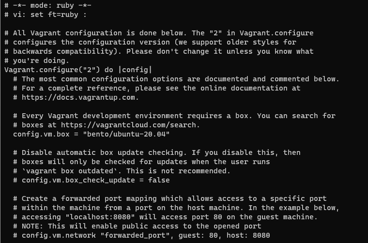
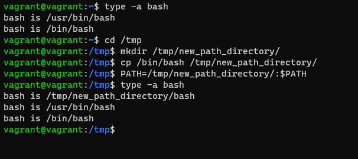

# ДЗ Работа в терминале. Лекция 1

1. Изменён конифигурационный файл.

Установлена ОС. Проверены команды `vagrant suspend` и `vagrant halt`

2. Ресурсы, выделенные по умолчанию:

CPU - 2

RAM - 1024 MB

Disk - 64 GB

GPU - 4 MB

3. Изменить CPU и RAM можно следующим образом:

config.vm.provider "virtualbox" do |v|

v.memory = 1024

v.cpus = 2

end

4. Подключние по SSH выполнено командой `vagrant ssh`.
5. Переменная HISTFILESIZE, строка 548.

ignoreboth – это сокращение от значений «ignorespace» и «ignoredups». Если установить эти два значения в переменную HISTCONTROL, строки, начинающиеся с пробела и дубликаты, не будут сохранены.

6. Это зарезервированный символ (строка 123). Используется в условных опреаторах, циклах, функциях (строка 176)
7. Команда для создания touch {000001..100000}.txt. При создании 300000 файлов будет ошибка Argument list too long.
8. Данная конструкция определяет наличие каталога. Возвращает 0 при отсутствии или 1 при наличии.
9. Изменение вывода команды `type -a bash`.

10. batch - выполняет задания, если позволяет уровень загрузки системы. По умолчанию задания выполняются, когда средняя загрузка системы ниже 1,5. Если средняя загрузка системы выше указанной, задания будут ждать в очереди.
    at - выполняет команды в определенное время и один раз.
11. Отключаем ВМ с помощью vagrant halt
