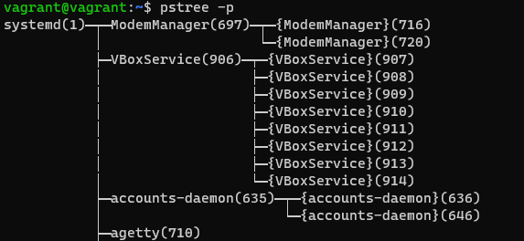
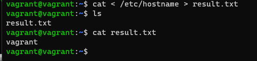
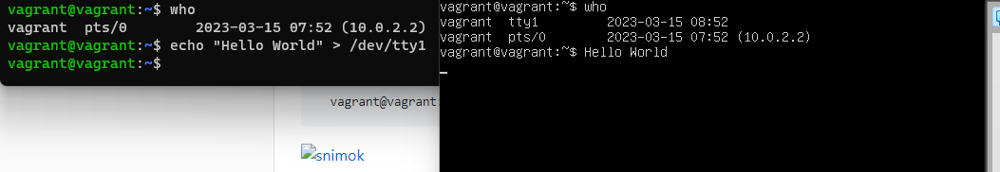
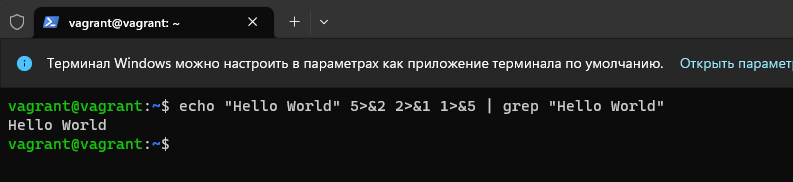
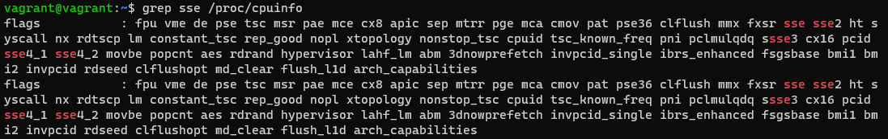
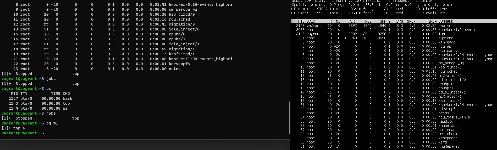

# ДЗ Работа в терминале. Лекция 2

1. Какого типа команда cd? Попробуйте объяснить, почему она именно такого типа: опишите ход своих мыслей, если считаете, что она могла бы быть другого типа.
   Ответ:
   Команда cd является встроенной командой оболочки bash. Встроенные (внутренние) команды отличаются от внешних тем, что им не нужно искать путь в PATH и создавать новый процесс. Встроенные команды выполняются моментально.
2. Какая альтернатива без pipe команде grep <some_string> <some_file> | wc -l?
   Ответ:
   grep -c <some_string> <some_file>

   3. Какой процесс с PID 1 является родителем для всех процессов в вашей виртуальной машине Ubuntu 20.04?
      Ответ:

      
   4. Как будет выглядеть команда, которая перенаправит вывод stderr ls на другую сессию терминала?
      Ответ:

      ls -l /etc 2 > /dev/pts/1
   5. Получится ли одновременно передать команде файл на stdin и вывести ее stdout в другой файл? Приведите работающий пример.

      Ответ:

      cat < /etc/hostname > result.txt

      
   6. Получится ли, находясь в графическом режиме, вывести данные из PTY в какой-либо из эмуляторов TTY? Сможете ли вы наблюдать выводимые данные?
      Ответ:

      
   7. Выполните команду bash 5>&1. К чему она приведет? Что будет, если вы выполните echo netology > /proc/$$/fd/5? Почему так происходит?
      Ответ:

      Команда `bash 5>&1` создает новый дескритор 5 и связывает его со стандартным дескриптором вывода stdout. При выполнении команды `echo netology > /proc/$$/fd/5` произойдёт передача вывода команды echo на дескриптор 5, а затем на stdout.
   8. Получится ли в качестве входного потока для pipe использовать только stderr команды, не потеряв при этом отображение stdout на pty?
      Напоминаем: по умолчанию через pipe передается только stdout команды слева от | на stdin команды справа. Это можно сделать, поменяв стандартные потоки местами через промежуточный новый дескриптор, который вы научились создавать в предыдущем вопросе.

      Ответ:

      
   9. Что выведет команда cat /proc/$$/environ? Как еще можно получить аналогичный по содержанию вывод?

      Ответ:

      Данная команда выводит переменные среды. Аналогичный вывод дадут команды printenv, env.
   10. Используя man, опишите что доступно по адресам /proc/<PID>/cmdline, /proc/<PID>/exe.

       Ответ:

       /proc/<PID>/cmdline - командная строка и аргументы запускаемого процесса

       /proc/<PID>/exe - символьная ссылка на исполняемый файл
   11. Узнайте, какую наиболее старшую версию набора инструкций SSE поддерживает ваш процессор с помощью /proc/cpuinfo.

       Ответ:

       
   12. При открытии нового окна терминала и vagrant ssh создается новая сессия и выделяется pty.
       Это можно подтвердить командой tty, которая упоминалась в лекции 3.2.
       Однако:

vagrant@netology1:~$ ssh localhost 'tty'
not a tty

Почитайте, почему так происходит, и как изменить поведение.

Ответ:

При использовании SSH не создаётся псевдотерминал (pty), поэтому появляется данное сообщение. Это решается добавлением ключа -t.

13. Бывает, что есть необходимость переместить запущенный процесс из одной сессии в другую. Попробуйте сделать это, воспользовавшись reptyr. Например, так можно перенести в screen процесс, который вы запустили по ошибке в обычной SSH-сессии.
    Ответ:
    Был перенесён процесс top
    
14. sudo echo string > /root/new_file не даст выполнить перенаправление под обычным пользователем, так как перенаправлением занимается процесс shell'а, который запущен без sudo под вашим пользователем. Для решения данной проблемы можно использовать конструкцию echo string | sudo tee /root/new_file. Узнайте, что делает команда tee и почему в отличие от sudo echo команда с sudo tee будет работать.
    Ответ:
    Команда с tee будет работать, т.к. имеет повышенные привилегии. Команда tee делает вывод сразу в stdout и в файл перенаправления. Она получает от stdout команды echo, которая запущена от sudo.
