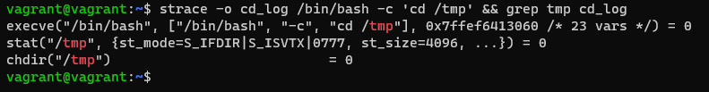
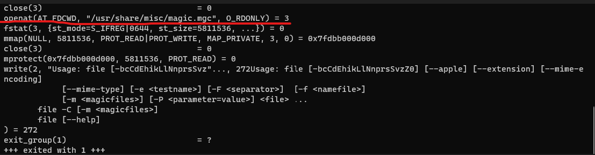
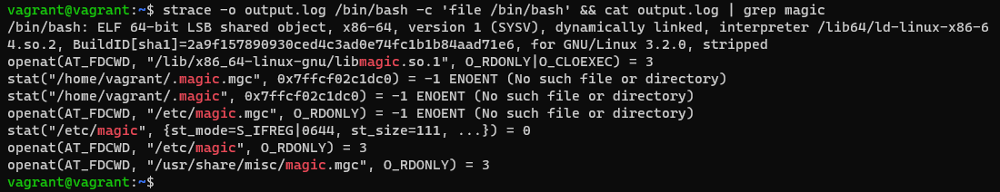
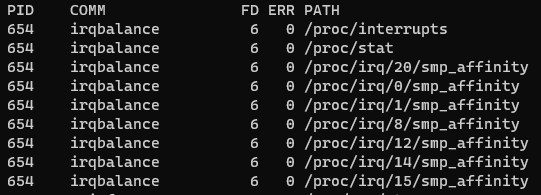
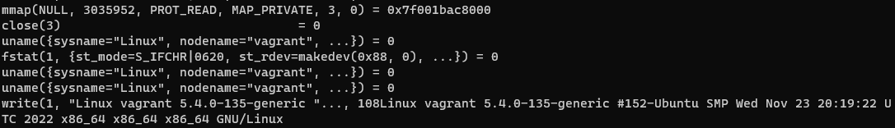
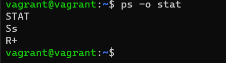

# ДЗ Операционные системы. Лекция 1

1. Какой системный вызов делает команда `cd`?
   В прошлом ДЗ мы выяснили, что `cd` не является самостоятельной программой, это `shell builtin`, поэтому запустить `strace` непосредственно на `cd` не получится. Тем не менее, вы можете запустить `strace` на `/bin/bash -c 'cd /tmp'`. В этом случае вы увидите полный список системных вызовов, которые делает сам `bash` при старте.
   Вам нужно найти тот единственный, который относится именно к `cd`. Обратите внимание, что `strace` выдаёт результат своей работы в поток stderr, а не в stdout.
   Ответ:
   chdir("/tmp")

   
2. Попробуйте использовать команду file на объекты разных типов в файловой системе. Используя strace выясните, где находится база данных file, на основании которой она делает свои догадки.
   Ответ:
   man file указывает, что file обращается к magic.mgc. Делаем strace file. Находим строки с magic.mgc

   

   Используем команду strace и grep для сортировки. Видим, что идёт обращение к библиотеке libmagic.so.1 и файлу magic.mgc. Отсюда берутся данные.

   
3. Предположим, приложение пишет лог в текстовый файл. Этот файл оказался удален (deleted в lsof), однако возможности сигналом сказать приложению переоткрыть файлы или просто перезапустить приложение – нет. Так как приложение продолжает писать в удаленный файл, место на диске постепенно заканчивается. Основываясь на знаниях о перенаправлении потоков предложите способ обнуления открытого удаленного файла (чтобы освободить место на файловой системе).
   Ответ:

   С помощью lsof | grep <file_name> определяем дескриптор. Затем делаем обнуление cat /dev/null > /proc/<PID процесса>/fd/<Файловый дескриптор>
4. Занимают ли зомби-процессы какие-то ресурсы в ОС (CPU, RAM, IO)?
   Ответ:

   Зомби-процессы не используют ресурсы ОС. Они занимают запись в таблице процессов, тем самым исчерпывая её лимит.
5. В iovisor BCC есть утилита opensnoop:

   root@vagrant:~# dpkg -L bpfcc-tools | grep sbin/opensnoop
   /usr/sbin/opensnoop-bpfcc
   На какие файлы вы увидели вызовы группы open за первую секунду работы утилиты? Воспользуйтесь пакетом bpfcc-tools для Ubuntu 20.04.

   Ответ:

   
6. Какой системный вызов использует uname -a? Приведите цитату из man по этому системному вызову, где описывается альтернативное местоположение в /proc, где можно узнать версию ядра и релиз ОС.
   Ответ:
   Системный вызов uname().

   

   Цитата из man 2 uname: Part of the utsname information is also accessible via /proc/sys/kernel/{ostype, hostname, osrelease, version,
   domainname}
7. Чем отличается последовательность команд через ; и через && в bash? Есть ли смысл использовать в bash &&, если применить set -e?
   Ответ:

   ; - разделитель последовательных команд.
   && - логический оператор.
   При использовании ; команды будут выполняться друга за другом в любом случае. При использовании && выполнение остановится при неудачном выполнении предыдущей команды.
   Применять set -e c && не имеет смысла, т.к. произойдёт моментальный выход, если команда завершится с ненулевым статусом.
8. Из каких опций состоит режим bash set -euxo pipefail и почему его хорошо было бы использовать в сценариях?

   Ответ:

   -e - завершает выполнение команды, если она возвращает ненулевой статус
   -x - распечатка трассировки простых команд
   -u - неустановленные или не заданные параметры и переменные считаются как ошибки. Сообщение об ошибке будет записано в stderr, и неинтерактивная оболочка завершит работу
   -o - pipefail - если задано, возвращаемое значение конвейера - это значение последней (самой правой) команды для завершения с ненулевым статусом, или ноль, если все команды в конвейере завершаются успешно. По умолчанию эта опция отключена.

   Данный режим хорошо было бы использовать в сценариях, т.к. задача завершается при возникновении ошибки и из-за детального логирования.
9. Используя -o stat для ps, определите, какой наиболее часто встречающийся статус у процессов в системе. В man ps ознакомьтесь (/PROCESS STATE CODES) что значат дополнительные к основной заглавной буквы статуса процессов. Его можно не учитывать при расчете (считать S, Ss или Ssl равнозначными).

   Ответ:

   Встречаются Ss и R+

   

PROCESS STATE CODES
Here are the different values that the s, stat and state output specifiers (header "STAT" or "S") will display to describe the
state of a process:

D    uninterruptible sleep (usually IO) - непрерывный режим ожидания (обычно ввод-вывод);
I    Idle kernel thread - ожидание потока ядра;
R    running or runnable (on run queue) - запущенный или пригодный для выполнения (в очереди выполнения);
S    interruptible sleep (waiting for an event to complete) - прерываемый режим сна (ожидание завершения события);
T    stopped by job control signal - остановлен сигналом управления заданием;
t    stopped by debugger during the tracing - остановлен отладчиком во время трассировки;
W    paging (not valid since the 2.6.xx kernel) - подкачка по страницам (недопустима начиная с ядра 2.6.xx);
X    dead (should never be seen) - мертв (никогда не должен быть замечен);
Z    defunct ("zombie") process, terminated but not reaped by its parentнесуществующий ("зомби") процесс, завершенный, но не возвращенный своим родителем
