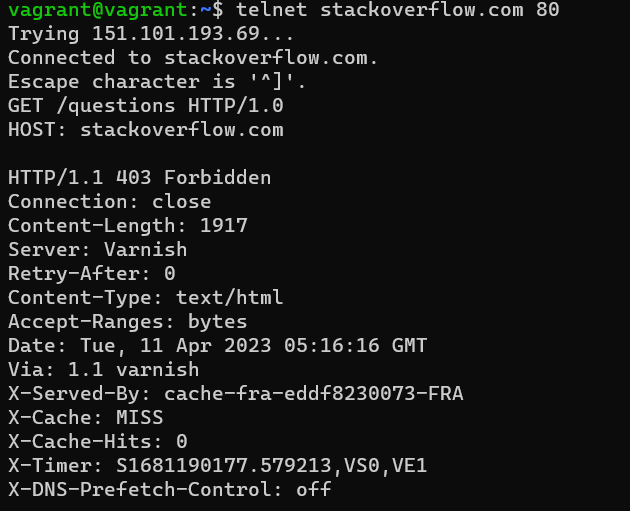
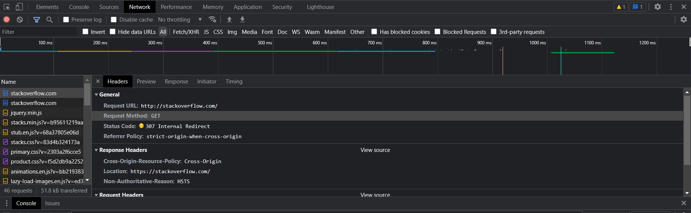
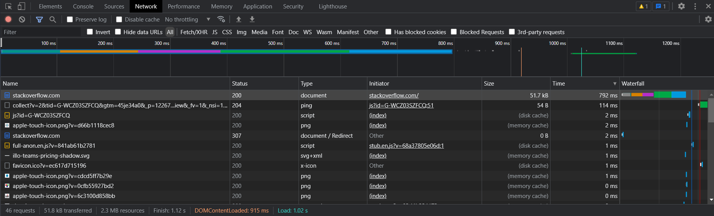
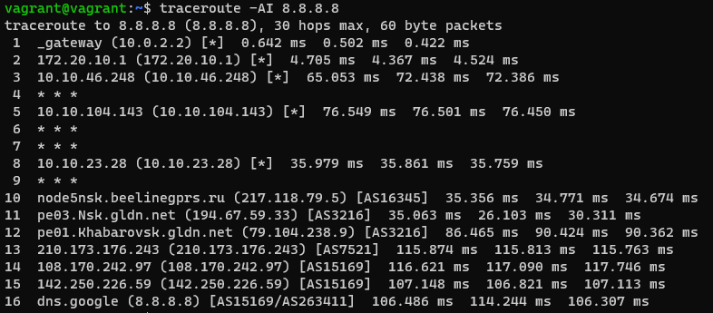
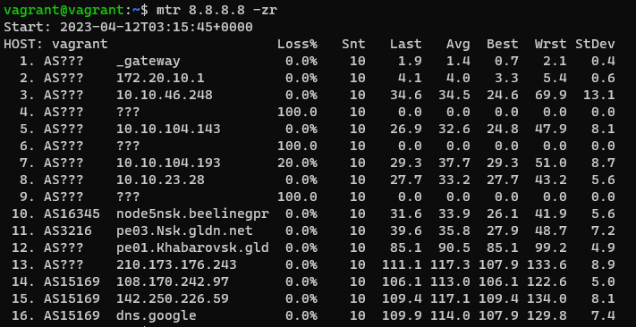
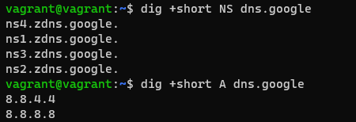
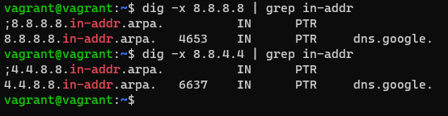

# ДЗ Компьютерные сети. Лекция 1

1. Работа c HTTP через telnet.

Ответ:

Ошибка **403** **Forbidden** — это код состояния протокола **HTTP**, которым обозначается ограничение доступа к URL, набранному в адресной строке. **403**-я ошибка сигнализирует о том, что просмотр конкретной страницы, файла или папки запрещен, поскольку у вас нет на это прав.

2. Повторите задание 1 в браузере, используя консоль разработчика F12:

- откройте вкладку Network;
- отправьте запрос http://stackoverflow.com;
- найдите первый ответ HTTP-сервера, откройте вкладку Headers;
- укажите в ответе полученный HTTP-код;
- проверьте время загрузки страницы и определите, какой запрос обрабатывался дольше всего;
- приложите скриншот консоли браузера в ответ.

Ответ:

Код первого ответа HTTP-сервера - 307 Internal Redirect

Время загрузки страницы - 1.12 с., самый долгий запрос - начальная загрузка страницы 792 мс.

3. Какой IP-адрес у вас в интернете?

   Ответ:

   vagrant@vagrant:~$ dig +short myip.opendns.com @resolver1.opendns.com
   5.166.154.153
4. Какому провайдеру принадлежит ваш IP-адрес? Какой автономной системе AS? Воспользуйтесь утилитой whois.
   Ответ:

IP-адрес принадлежит провайдеру CJSC "ER-Telecom Holding" и автономной зоне AS51570.

5. Через какие сети проходит пакет, отправленный с вашего компьютера на адрес 8.8.8.8? Через какие AS? Воспользуйтесь утилитой traceroute.

Ответ:

6. Повторите задание 5 в утилите mtr. На каком участке наибольшая задержка — delay?
   Ответ:

   Самая большая задержка на узле 13.

7. Какие DNS-сервера отвечают за доменное имя dns.google? Какие A-записи? Воспользуйтесь утилитой `dig`.

Ответ:

8. Проверьте PTR записи для IP-адресов из задания 7. Какое доменное имя привязано к IP? Воспользуйтесь утилитой dig.

Ответ:

