# ДЗ Файловые системы

1. Узнайте о sparse (разряженных) файлах.

Ответ:

Разрежённые файлы – это специальные файлы, которые с большей эффективностью используют файловую систему, они не позволяют ФС занимать свободное дисковое пространство носителя, когда разделы не заполнены.

2. Могут ли файлы, являющиеся жесткой ссылкой на один объект, иметь разные права доступа и владельца? Почему?
   Ответ:
   Не могут, т.к. жёсткая ссылка ведёт к оригинальному inode (индексному дескриптору), у которого есть своим права доступа и владельцы.
4. Сделайте vagrant destroy на имеющийся инстанс Ubuntu.

Ответ:

Новый инстанс Ubuntu создан.

4. Используя fdisk, разбейте первый диск на 2 раздела: 2 Гб, оставшееся пространство.
   Ответ:

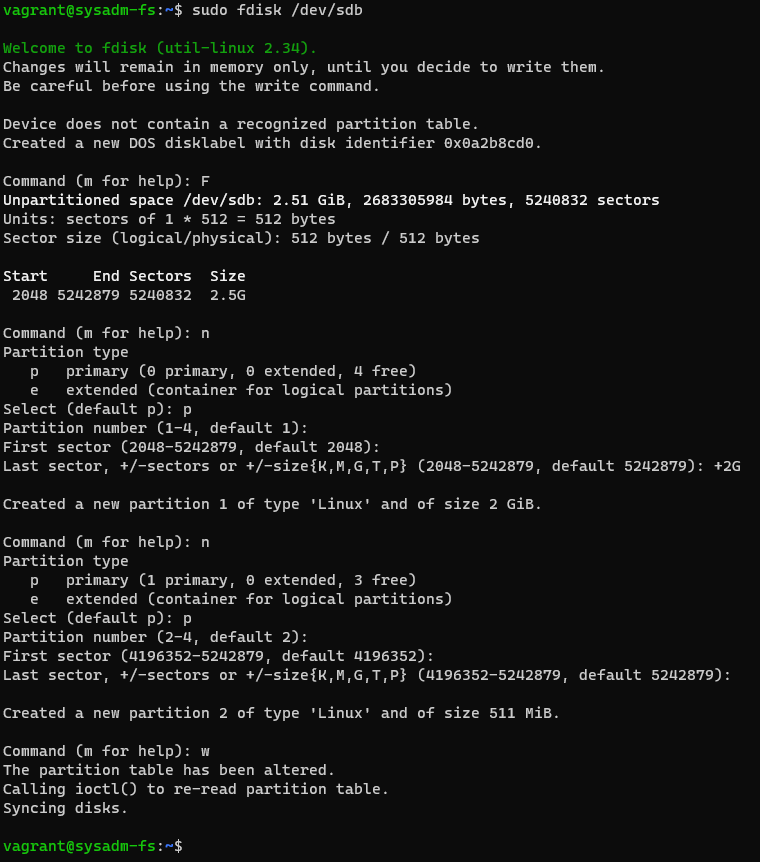

5. Используя sfdisk, перенесите данную таблицу разделов на второй диск.

Ответ:

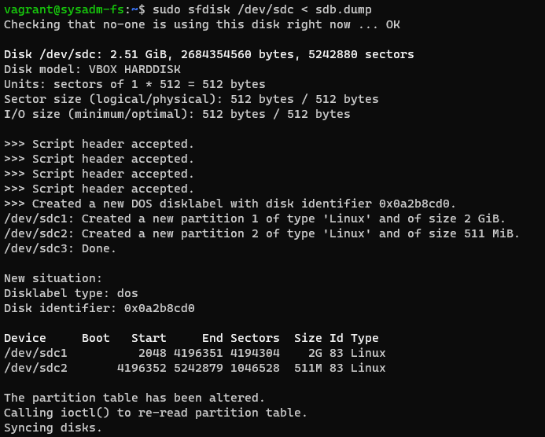

6. Соберите mdadm RAID1 на паре разделов 2 Гб.
   Ответ:

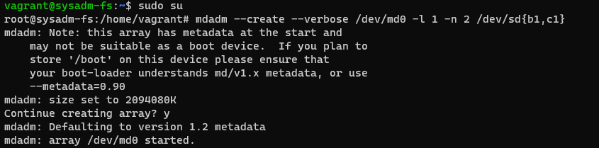

7. Соберите mdadm RAID0 на второй паре маленьких разделов.

Ответ:

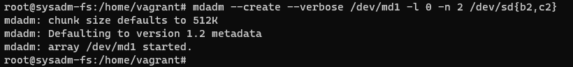

8. Создайте 2 независимых PV на получившихся md-устройствах.
   Ответ:
   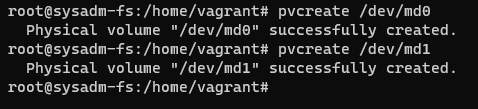
9. Создайте общую volume-group на этих двух PV.
   Ответ:
   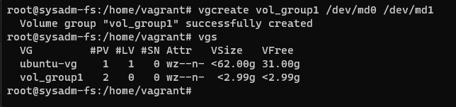
10. Создайте LV размером 100 Мб, указав его расположение на PV с RAID0.
    Ответ:
    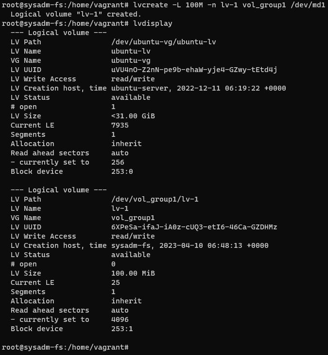
11. Создайте mkfs.ext4 ФС на получившемся LV.
    Ответ:
    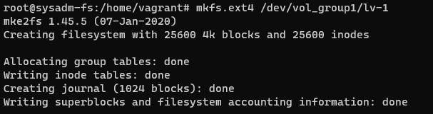
12. Смонтируйте этот раздел в любую директорию, например, /tmp/new.
    Ответ:
    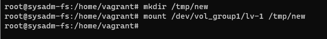
13. Поместите туда тестовый файл, например wget https://mirror.yandex.ru/ubuntu/ls-lR.gz -O /tmp/new/test.gz.
    Ответ:
    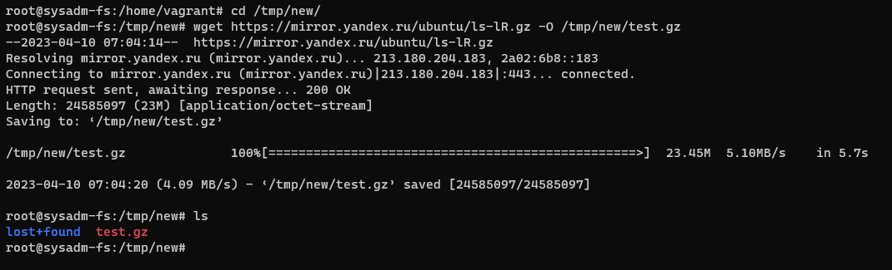
14. Прикрепите вывод lsblk.
    Ответ:
    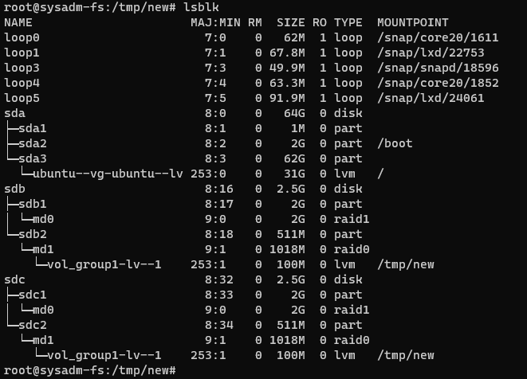
15. Протестируйте целостность файла.
    Ответ:
    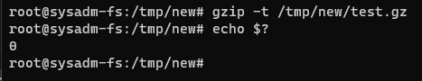
16. Используя pvmove, переместите содержимое PV с RAID0 на RAID1.
    Ответ:
    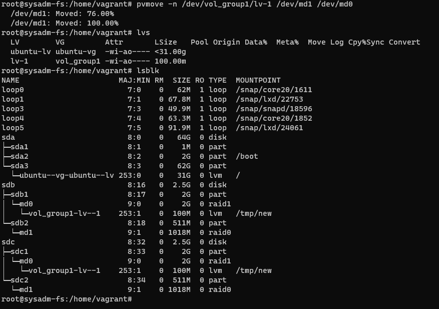
17. Сделайте --fail на устройство в вашем RAID1 md.
    Ответ:
    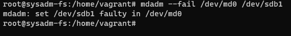
18. Подтвердите выводом dmesg, что RAID1 работает в деградированном состоянии.
    Ответ:
    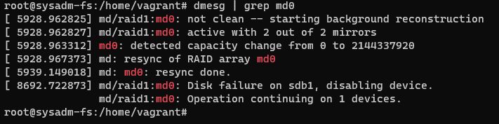
19. Протестируйте целостность файла, несмотря на "сбойный" диск он должен продолжать быть доступен.
    Ответ:
    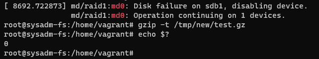
20. Погасите тестовый хост, vagrant destroy.
    Ответ:
    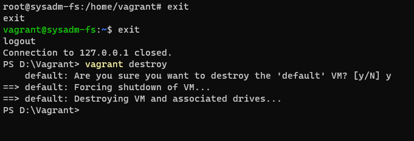
