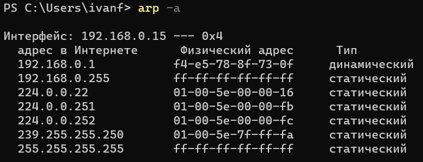

# ДЗ Компьютерные сети. Лекция 2

1. Проверьте список доступных сетевых интерфейсов на вашем компьютере. Какие команды есть для этого в Linux и в Windows?

Ответ:

На Linux:

На Windows:

2. Какой протокол используется для распознавания соседа по сетевому интерфейсу? Какой пакет и команды есть в Linux для этого?

Ответ:

Используется протокол LLDP и NDP (IPv6). В Linux для распознования используется пакет lldpd и команда lldpctl.

3. Какая технология используется для разделения L2 коммутатора на несколько виртуальных сетей? Какой пакет и команды есть в Linux для этого? Приведите пример конфига.

   Ответ:

   Технология VLAN используется для разделения L2 коммутатора на несколько виртуальных сетей. Для этого используется пакет vlan и команды vconfig, ip.

   Пример конфига:

   
5. Какие типы агрегации интерфейсов есть в Linux? Какие опции есть для балансировки нагрузки? Приведите пример конфига.
   Ответ:

Mode-0(balance-rr) – Данный режим используется по умолчанию. Balance-rr обеспечивается балансировку нагрузки и отказоустойчивость. В данном режиме сетевые пакеты отправляются “по кругу”, от первого интерфейса к последнему. Если выходят из строя интерфейсы, пакеты отправляются на остальные оставшиеся. Дополнительной настройки коммутатора не требуется при нахождении портов в одном коммутаторе. При разностных коммутаторах требуется дополнительная настройка.

Mode-1(active-backup) – Один из интерфейсов работает в активном режиме, остальные в ожидающем. При обнаружении проблемы на активном интерфейсе производится переключение на ожидающий интерфейс. Не требуется поддержки от коммутатора.

Mode-2(balance-xor) – Передача пакетов распределяется по типу входящего и исходящего трафика по формуле ((MAC src) XOR (MAC dest)) % число интерфейсов. Режим дает балансировку нагрузки и отказоустойчивость. Не требуется дополнительной настройки коммутатора/коммутаторов.

Mode-3(broadcast) – Происходит передача во все объединенные интерфейсы, тем самым обеспечивая отказоустойчивость. Рекомендуется только для использования MULTICAST трафика.

Mode-4(802.3ad) – динамическое объединение одинаковых портов. В данном режиме можно значительно увеличить пропускную способность входящего так и исходящего трафика. Для данного режима необходима поддержка и настройка коммутатора/коммутаторов.

Mode-5(balance-tlb) – Адаптивная балансировки нагрузки трафика. Входящий трафик получается только активным интерфейсом, исходящий распределяется в зависимости от текущей загрузки канала каждого интерфейса. Не требуется специальной поддержки и настройки коммутатора/коммутаторов.

Mode-6(balance-alb) – Адаптивная балансировка нагрузки. Отличается более совершенным алгоритмом балансировки нагрузки чем Mode-5). Обеспечивается балансировку нагрузки как исходящего так и входящего трафика. Не требуется специальной поддержки и настройки коммутатора/коммутаторов.

Пример конфига balance-alb:

5. Сколько IP-адресов в сети с маской /29 ? Сколько /29 подсетей можно получить из сети с маской /24. Приведите несколько примеров /29 подсетей внутри сети 10.10.10.0/24.

Ответ:

В сети с маской /29 будет 6 IP-адресов. В сети с данной маской можно получить 32 подсети.

Пример подсетей /29 с учётом IP для сети и широковещательного:

10.10.10.0 - 10.10.10.7
10.10.10.8 - 10.10.10.15
10.10.10.16 - 10.10.10.23
10.10.10.24 - 10.10.10.31

6. Задача: вас попросили организовать стык между двумя организациями. Диапазоны 10.0.0.0/8, 172.16.0.0/12, 192.168.0.0/16 уже заняты. Из какой подсети допустимо взять частные IP-адреса? Маску выберите из расчёта — максимум 40–50 хостов внутри подсети.
   Ответ:

   Из подсети 100.64.0.0/10 допустимо взять частные IP адреса. Можно использовать до 62 хостов.

7. Как проверить ARP-таблицу в Linux, Windows? Как очистить ARP-кеш полностью? Как из ARP-таблицы удалить только один нужный IP?

Ответ:

Проверка ARP-таблицы в Linux:

Проверка ARP-таблицы в Windows:

Очистка ARP-кеша в Linux - ip neigh flush all, в Windows - arp -d *.

Удаление одного адреса из ARP-таблицы в Linux - ip neigh flush (IP), в Windows - arp -d (IP).
