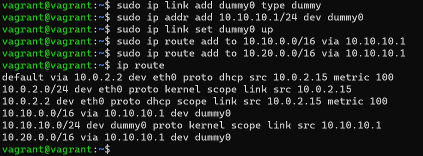
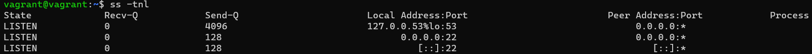
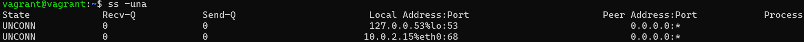
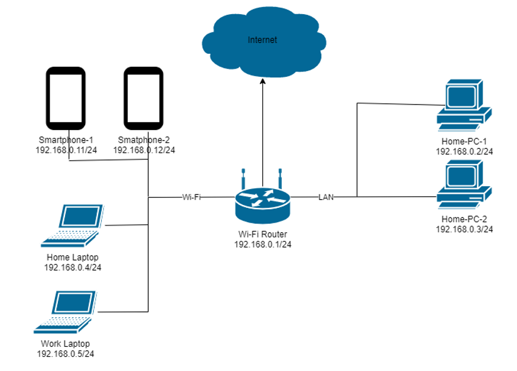

# ДЗ Компьютерные сети. Лекция 3

1. Подключитесь к публичному маршрутизатору в интернет. Найдите маршрут к вашему публичному IP.

Ответ:

vagrant@vagrant:~$ telnet route-views.routeviews.org
Trying 128.223.51.103...
Connected to route-views.routeviews.org.
Escape character is '^]'.
C

---

                RouteViews BGP Route Viewer
                route-views.routeviews.org
route views data is archived on http://archive.routeviews.org

This hardware is part of a grant by the NSF.
Please contact help@routeviews.org if you have questions, or
if you wish to contribute your view.

This router has views of full routing tables from several ASes.
The list of peers is located at http://www.routeviews.org/peers
in route-views.oregon-ix.net.txt

NOTE: The hardware was upgraded in August 2014.  If you are seeing
the error message, "no default Kerberos realm", you may want to
in Mac OS X add "default unset autologin" to your ~/.telnetrc

To login, use the username "rviews".

---

User Access Verification

Username: rviews
route-views>show ip route 5.166.154.153
Routing entry for 5.166.152.0/22
Known via "bgp 6447", distance 20, metric 0
Tag 6939, type external
Last update from 64.71.137.241 5d09h ago
Routing Descriptor Blocks:

* 64.71.137.241, from 64.71.137.241, 5d09h ago
  Route metric is 0, traffic share count is 1
  AS Hops 3
  Route tag 6939
  MPLS label: none
  route-views>show bgp 5.166.154.153
  BGP routing table entry for 5.166.152.0/22, version 2798057424
  Paths: (19 available, best #5, table default)
  Not advertised to any peer
  Refresh Epoch 1
  8283 1299 9049 51570
  94.142.247.3 from 94.142.247.3 (94.142.247.3)
  Origin IGP, metric 0, localpref 100, valid, external
  Community: 1299:30000 8283:1 8283:101
  unknown transitive attribute: flag 0xE0 type 0x20 length 0x18
  value 0000 205B 0000 0000 0000 0001 0000 205B
  0000 0005 0000 0001
  path 7FE0C3C45460 RPKI State not found
  rx pathid: 0, tx pathid: 0
  Refresh Epoch 1
  3333 9002 9049 51570
  193.0.0.56 from 193.0.0.56 (193.0.0.56)
  Origin IGP, localpref 100, valid, external
  path 7FE0873B7198 RPKI State not found
  rx pathid: 0, tx pathid: 0
  Refresh Epoch 1
  1351 6939 9049 51570
  132.198.255.253 from 132.198.255.253 (132.198.255.253)
  Origin IGP, localpref 100, valid, external
  path 7FE153D14168 RPKI State not found
  rx pathid: 0, tx pathid: 0
  Refresh Epoch 1
  7018 1299 9049 51570
  12.0.1.63 from 12.0.1.63 (12.0.1.63)
  Origin IGP, localpref 100, valid, external

2. Создайте dummy0 интерфейс в Ubuntu. Добавьте несколько статических маршрутов. Проверьте таблицу маршрутизации.

Ответ:

3. Проверьте открытые TCP порты в Ubuntu, какие протоколы и приложения используют эти порты? Приведите несколько примеров.

   Ответ:

   53 - порт DNS, 22 - порт SSH.

   
5. Проверьте используемые UDP сокеты в Ubuntu, какие протоколы и приложения используют эти порты?
   Ответ:

53 - порт DNS, 68 - порт DHCP, используется DHCP-клиентами для получения IP-адреса.

5. Используя diagrams.net, создайте L3 диаграмму вашей домашней сети или любой другой сети, с которой вы работали.

Ответ:

