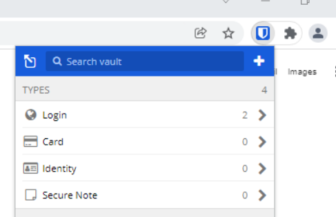
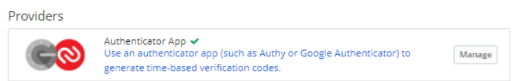
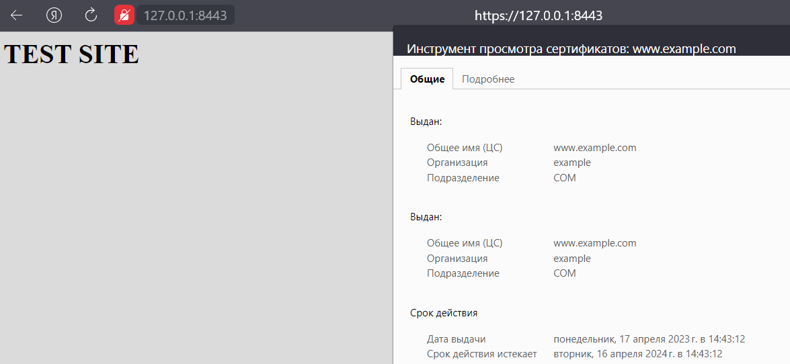
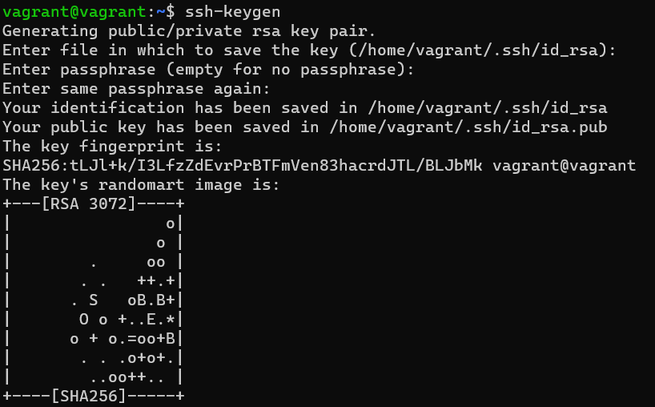
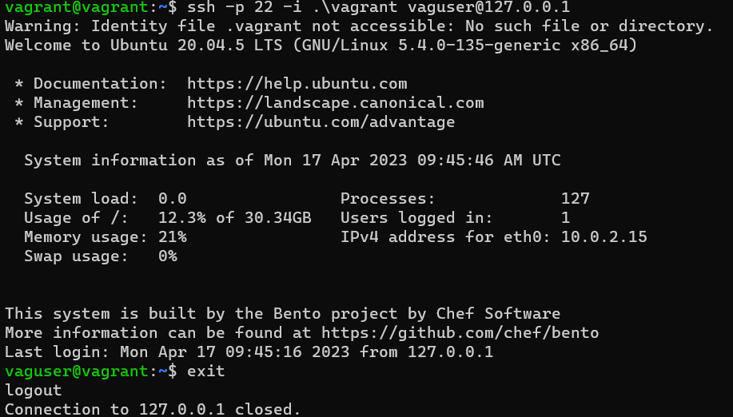
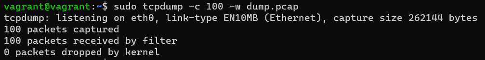
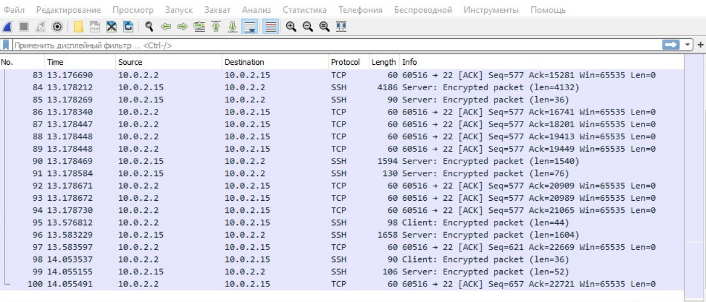

# ДЗ Элементы безопасности информационных систем

1. Установите Bitwarden плагин для браузера. Зарегестрируйтесь и сохраните несколько паролей.

Ответ:

Плагин установлен, пароли сохранены.



2. Установите Google authenticator на мобильный телефон. Настройте вход в Bitwarden акаунт через Google authenticator OTP.

Ответ:

Настроен вход через Google authenticator OTP.



3. Установите apache2, сгенерируйте самоподписанный сертификат, настройте тестовый сайт для работы по HTTPS.

   Ответ:

   ```
   vagrant@vagrant:~$ sudo apt install apache2
   vagrant@vagrant:~$ sudo ufw allow "Apache Full"
   vagrant@vagrant:~$ sudo a2enmod ssl
   vagrant@vagrant:~$ sudo systemctl restart apache2
   vagrant@vagrant:~$ sudo openssl req -x509 -nodes -days 365 -newkey rsa:2048 -keyout /etc/ssl/private/test-selfsigned.key -out /etc/ssl/certs/test-selfsigned.cert -subj "/C=US/ST=California/L=Los Angeles/O=example/OU=COM/CN=www.example.com"

   vagrant@vagrant:~$ sudo nano /etc/apache2/sites-available/www.example.com.conf

   <VirtualHost *:443>
   ServerName example.com
   DocumentRoot /var/www/example.com
   SSLEngine on
   SSLCertificateFile /etc/ssl/certs/test-selfsigned.cert
   SSLCertificateKeyFile /etc/ssl/private/test-selfsigned.key
   </VirtualHost>

   vagrant@vagrant:~$ sudo mkdir /var/www/example.com
   vagrant@vagrant:~$ sudo nano /var/www/example.com/index.html
   <h1>TEST SITE</h1>

   vagrant@vagrant:~$ sudo a2ensite www.example.com
   ```

   
5. Установите на Ubuntu ssh сервер, сгенерируйте новый приватный ключ. Скопируйте свой публичный ключ на другой сервер. Подключитесь к серверу по SSH-ключу.
   Ответ:

Генерируем ключ.



Копируем публичный ключ.


Пробуем войти.



5. Соберите дамп трафика утилитой tcpdump в формате pcap, 100 пакетов. Откройте файл pcap в Wireshark.

Ответ:




