# devops-cortel

Learning DevOps. Cortel.

Будут проигнорированы следующие файлы:

1. Все файлы в любом каталоге terraform в текущем проекте
2. Файлы с расширением .tfstate и содержащие tfstate
3. Файл crash.log и любые файлы crash с расширением .log
4. Все файлы tfvars и tfvars.json
5. Файлы override.tf, override.tf.json и все файлы заканчивающиеся на _override.tf и override.tf.json
6. Файлы .terraformrc и terraform.rc

# ДЗ Инструменты Git

Полный хеш и комментарий коммита aefea:

Ответы.

1. Какому тегу соответствует коммит 85024d3?

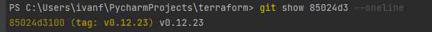

2. Сколько родителей у коммита b8d720? Напишите их хеши.

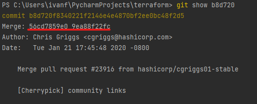

3. Перечислите хеши и комментарии всех коммитов, которые были сделаны между тегами v0.12.23 и v0.12.24.

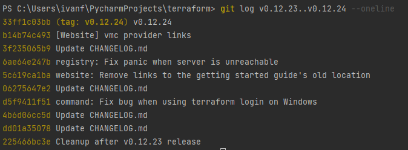

4. Найдите коммит, в котором была создана функция `func providerSource`, её определение в коде выглядит так: `func providerSource(...)` (вместо троеточия перечислены аргументы).

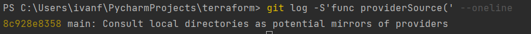

5. Найдите все коммиты, в которых была изменена функция `globalPluginDirs`.

Находим стртоку globalPluginDirs и определяем файл:

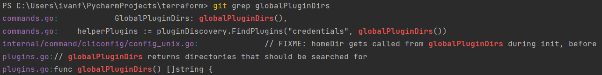

Определяем коммиты с изменением данной функции:

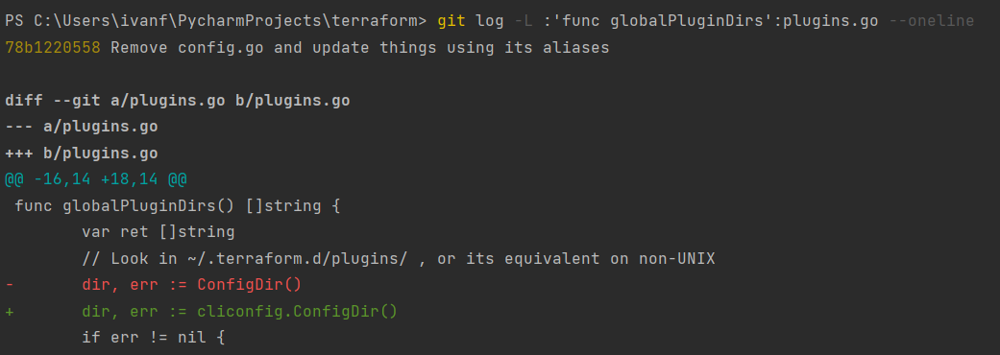

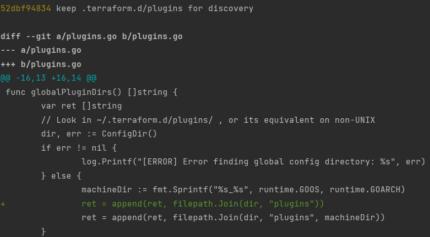

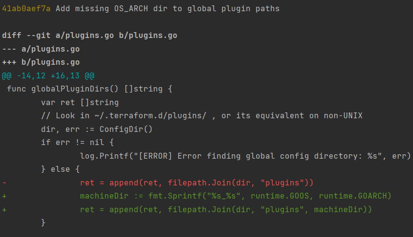

6. Кто автор функции `synchronizedWriters`?

Находим коммиты с данной функцией:

Смотрим оба коммита. Определяем автора, который создал функцию:

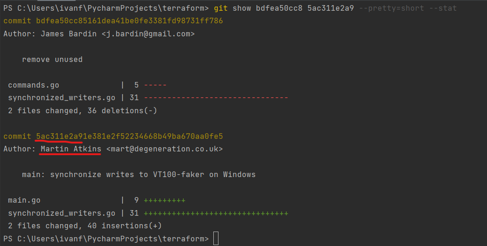

# ДЗ Работа в терминале. Лекция 1

1. Изменён конифигурационный файл.

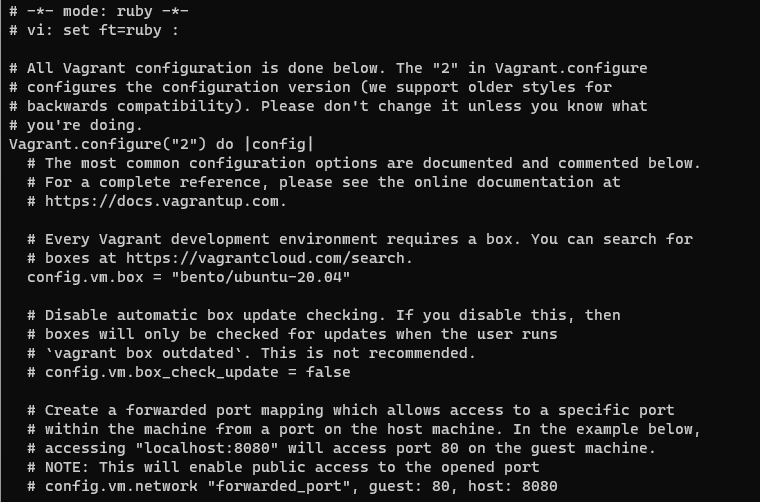

Установлена ОС. Проверены команды `vagrant suspend` и `vagrant halt`

2. Ресурсы, выделенные по умолчанию:

CPU - 2

RAM - 1024 MB

Disk - 64 GB

GPU - 4 MB

3. Изменить CPU и RAM можно следующим образом:

config.vm.provider "virtualbox" do |v|
  v.memory = 1024
  v.cpus = 2
end

4. Подключние по SSH выполнено командой `vagrant ssh`.
5. Переменная HISTFILESIZE, строка 548.

ignoreboth – это сокращение от значений «ignorespace» и «ignoredups». Если установить эти два значения в переменную HISTCONTROL, строки, начинающиеся с пробела и дубликаты, не будут сохранены.

6. Это зарезервированный символ (строка 123). Используется в условных опреаторах, циклах, функциях (строка 176)
7. Команда для создания touch {000001..100000}.txt. При создании 300000 файлов будет ошибка Argument list too long.
8. Данная конструкция определяет наличие каталога. Возвращает 0 при отсутствии или 1 при наличии.
9. Изменение вывода команды `type -a bash`.

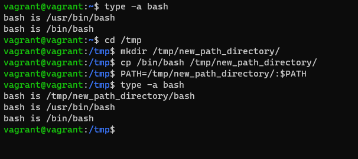

10. batch - выполняет задания, если позволяет уровень загрузки системы. По умолчанию задания выполняются, когда средняя загрузка системы ниже 1,5. Если средняя загрузка системы выше указанной, задания будут ждать в очереди.
    at - выполняет команды в определенное время и один раз.
11. Отключаем ВМ с помощью vagrant halt
