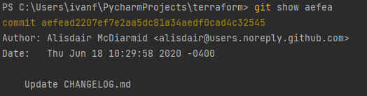
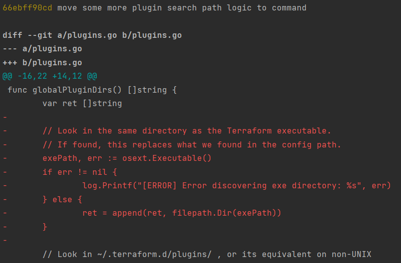
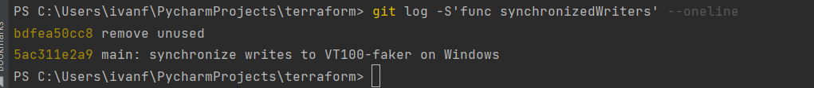

# devops-cortel

Learning DevOps. Cortel.

Будут проигнорированы следующие файлы:

1. Все файлы в любом каталоге terraform в текущем проекте
2. Файлы с расширением .tfstate и содержащие tfstate
3. Файл crash.log и любые файлы crash с расширением .log
4. Все файлы tfvars и tfvars.json
5. Файлы override.tf, override.tf.json и все файлы заканчивающиеся на _override.tf и override.tf.json
6. Файлы .terraformrc и terraform.rc

# ДЗ Инструменты Git

Полный хеш и комментарий коммита aefea:

Ответы.

1. Какому тегу соответствует коммит 85024d3?

2. Сколько родителей у коммита b8d720? Напишите их хеши.

3. Перечислите хеши и комментарии всех коммитов, которые были сделаны между тегами v0.12.23 и v0.12.24.

4. Найдите коммит, в котором была создана функция `func providerSource`, её определение в коде выглядит так: `func providerSource(...)` (вместо троеточия перечислены аргументы).

5. Найдите все коммиты, в которых была изменена функция `globalPluginDirs`.

Находим стртоку globalPluginDirs и определяем файл:

Определяем коммиты с изменением данной функции:

6. Кто автор функции `synchronizedWriters`?

Находим коммиты с данной функцией:

Смотрим оба коммита. Определяем автора, который создал функцию:

